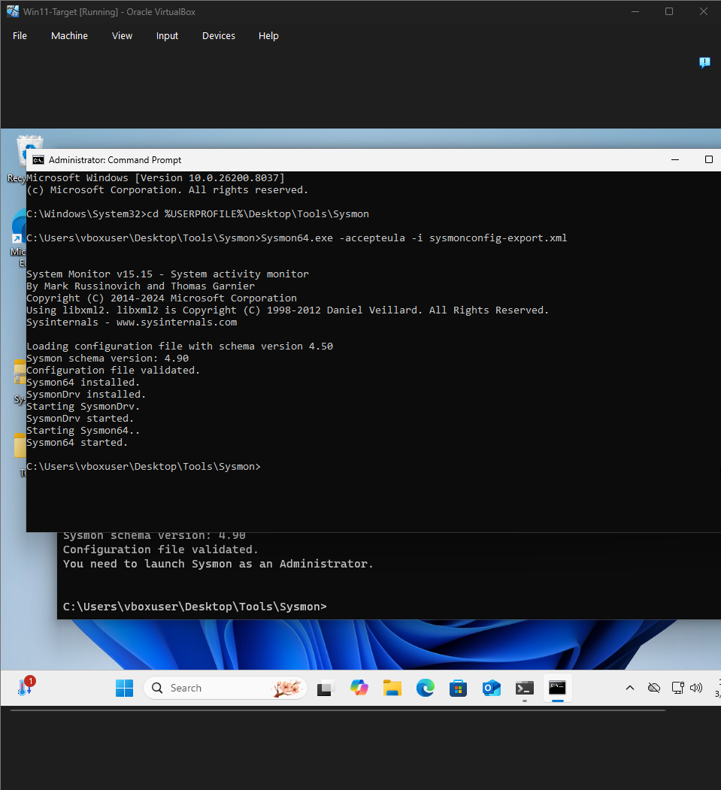
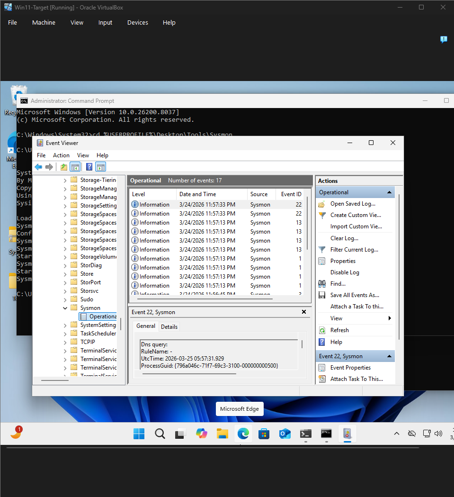
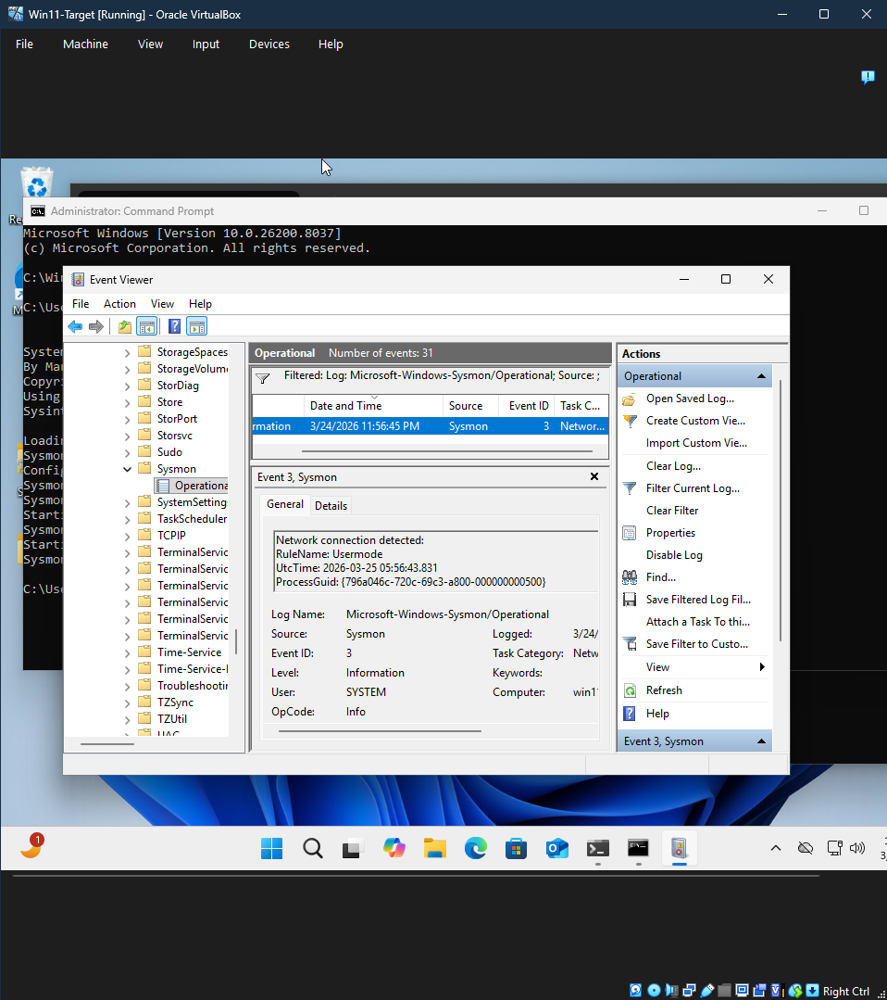
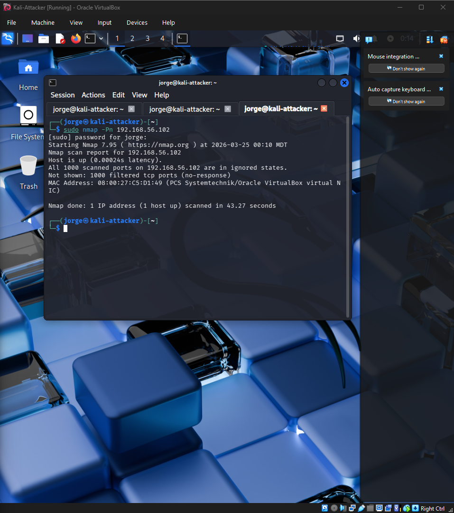
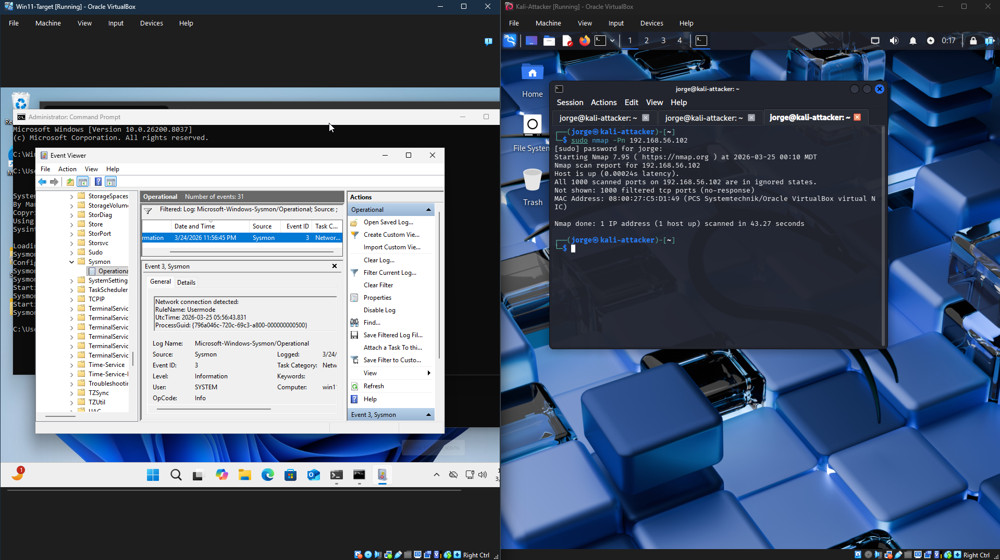
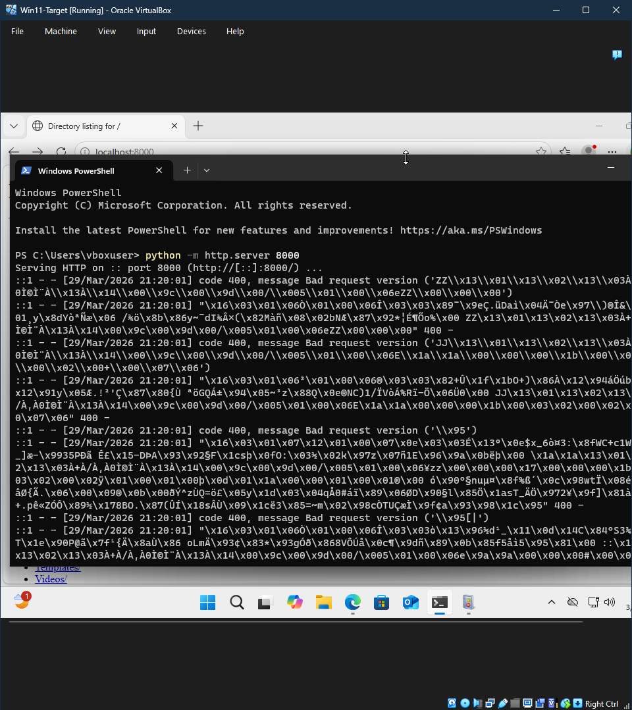
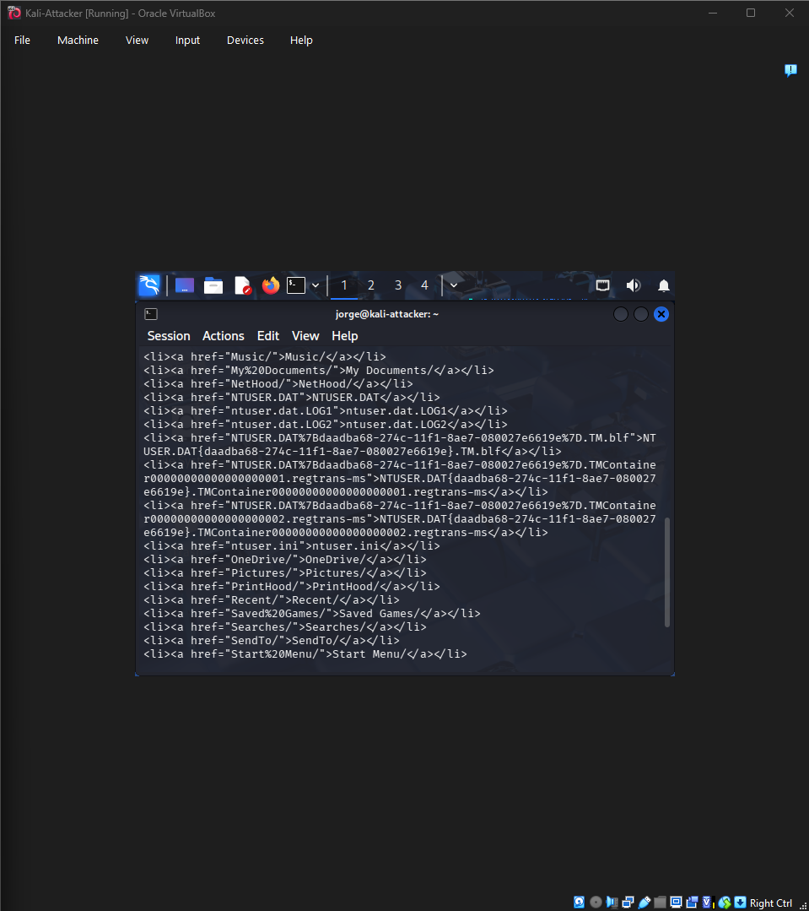
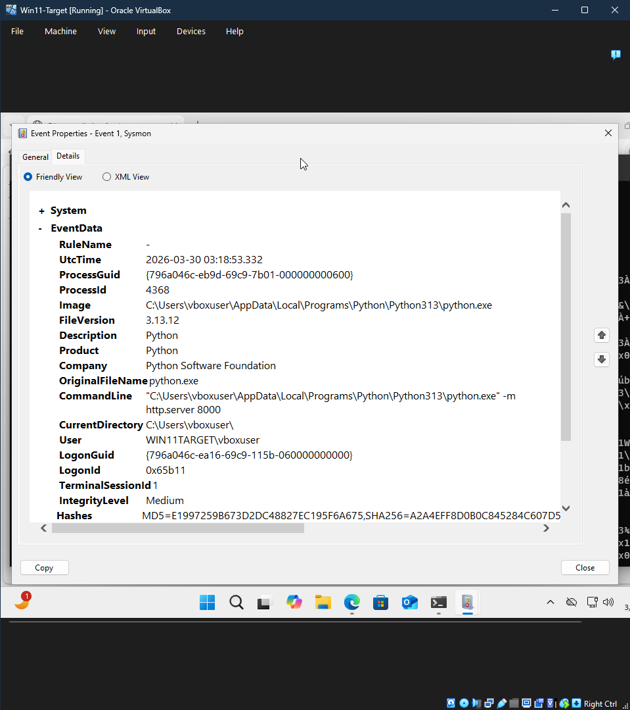
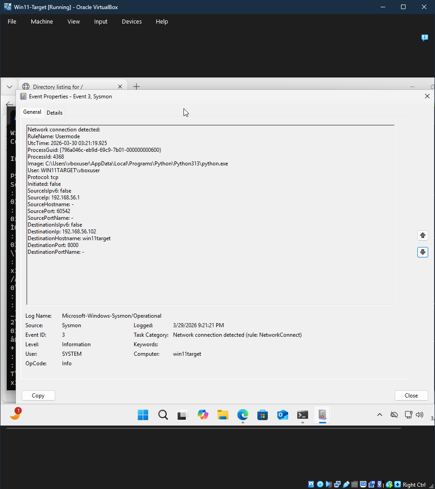

# Home Lab Security Monitoring

## Overview
This project is a beginner cybersecurity home lab built in VirtualBox using a Windows 11 virtual machine as the target system and a Kali Linux virtual machine as the attacker/testing system. The goal of the lab was to create a private network between both machines, generate test traffic from Kali, and monitor the Windows machine using Sysmon and Event Viewer.

## Objective
The objective of this project was to simulate basic network activity in a controlled lab environment and observe security-related logs on the Windows target machine. This helped demonstrate foundational blue team skills such as system monitoring, log review, and identifying network activity.

## Lab Diagram

## Tools Used
- VirtualBox
- Windows 11
- Kali Linux
- Sysmon
- Windows Event Viewer
- Nmap
- Command Prompt

## Lab Setup
The lab was built with two virtual machines:

- **Windows 11 VM** acting as the monitored target machine
- **Kali Linux VM** acting as the attacker/testing machine

Both VMs were configured with:
- **Adapter 1: NAT** for internet access
- **Adapter 2: Host-Only Adapter** for private communication between VMs

### IP Addresses
- **Windows Host-Only IP:** `192.168.56.102`
- **Kali Host-Only IP:** `192.168.56.101`

## Steps Performed

### 1. Created the Windows 11 VM
A Windows 11 virtual machine was created in VirtualBox with dedicated memory, processors, and storage.

### 2. Enabled Virtualization in BIOS
SVM Mode was enabled in BIOS so VirtualBox could run the 64-bit virtual machines correctly.

### 3. Created the Kali Linux VM
A Kali Linux virtual machine was installed to act as the testing and scanning system.

### 4. Configured Networking
Both VMs were configured with NAT and Host-Only networking. This allowed internet access while also creating a private internal lab network for direct communication.

### 5. Verified Connectivity
Connectivity was tested using ping between the Windows and Kali VMs over the Host-Only network.

### 6. Installed Sysmon on Windows
Sysmon was downloaded and installed on the Windows 11 VM using a Sysmon configuration file. This allowed the system to log security-relevant activity such as network connections and process creation.

### 7. Verified Sysmon Logs
Sysmon logs were viewed in:

`Event Viewer -> Applications and Services Logs -> Microsoft -> Windows -> Sysmon -> Operational`

### 8. Generated Test Activity from Kali
The Kali VM was used to send traffic to the Windows target using:
- `ping 192.168.56.102`
- `sudo nmap -sS 192.168.56.102`

### 9. Reviewed Detection Results
After generating traffic from Kali, the Sysmon Operational log on the Windows VM was reviewed. A Sysmon **Event ID 3** entry was observed, showing a network connection event was detected.

## Expanded Testing
To deepen the lab, a Python HTTP server was started on the Windows 11 VM using `python -m http.server 8000`. This exposed a test web service on port 8000.

From the Kali Linux VM, version detection was performed with:

`nmap -sV -p 8000 192.168.56.102`

The scan identified the service as `SimpleHTTPServer 0.6 (Python 3.13.12)` and confirmed that port 8000 was open.

Additional interaction was performed with:

`curl http://192.168.56.102:8000`

This returned the directory listing from the Windows host, showing successful access to the exposed service.

On the Windows side, Sysmon captured:
- **Event ID 1** showing the Python process creation with the command line used to start the HTTP server
- **Event ID 3** showing a network connection event associated with the Python process and port 8000

This expanded testing improved the lab by showing not only host discovery and scanning, but also service exposure, service identification, application interaction, and related endpoint telemetry.

## Findings
The lab successfully showed that:
- the Windows target and Kali attacker could communicate over a private virtual network
- Sysmon was installed and logging correctly
- test traffic generated from Kali could be observed on the Windows VM
- Sysmon Event ID 3 provided evidence of detected network activity
- a Python HTTP service exposed on port 8000 could be identified with Nmap and accessed with curl from Kali
- Sysmon Event ID 1 captured the Python process creation used to start the HTTP server

The initial Nmap scan reported that the target host was up, but all 1000 default ports were filtered. This likely indicates that Windows Defender Firewall was filtering or blocking scan traffic, which is still a valid and realistic lab result.

After exposing the Python HTTP server on port 8000, Kali was able to identify the service as `SimpleHTTPServer 0.6 (Python 3.13.12)` and retrieve the directory listing from the Windows host. This demonstrated a stronger attacker and defender workflow by combining service exposure, service interaction, and Windows-side endpoint logging.

## Skills Demonstrated
- Virtual machine setup in VirtualBox
- BIOS virtualization troubleshooting
- Network adapter configuration
- Host-only lab networking
- Windows log monitoring
- Sysmon installation and configuration
- Basic network scanning with Nmap
- Event analysis using Event Viewer

## Key Findings
- Successfully built a two-VM cybersecurity lab using VirtualBox.
- Verified host-only communication between Kali Linux and Windows 11.
- Installed and configured Sysmon for security event logging.
- Generated test traffic with ping, Nmap, and curl from Kali.
- Observed Sysmon Event ID 1 and Event ID 3 in Windows Event Viewer.
- Confirmed that a Python-based HTTP service on port 8000 could be discovered and accessed from Kali.

## Future Improvements
Possible future improvements for this lab include:
- adding Splunk or Wazuh for centralized logging
- capturing packets with Wireshark
- enabling additional Windows logging sources
- testing more network scans and detection scenarios
- creating dashboards for easier monitoring

## Lessons Learned
This project helped me better understand virtualization, BIOS-based virtualization settings, NAT versus host-only networking, Windows event logging, and how tools like Sysmon, Nmap, and curl can be used together in a controlled lab environment to simulate attacker activity and observe defender-side telemetry.

## Screenshots

### Sysmon Installation Success

### Sysmon Operational Log

### Event ID 3 Network Connection

### Kali Nmap Scan

### Windows and Kali Lab Running

### Python HTTP Server on Windows

### Curl Request from Kali

### Sysmon Event ID 1 Details

### Sysmon Event ID 3 Details

